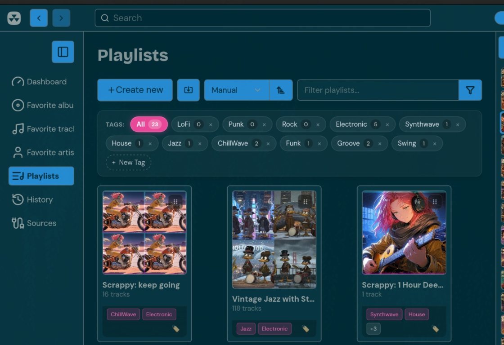

# nuclear-playlist-tags

[](LICENSE)
[](https://nuclearplayer.com)

A feature-packed extension for **Nuclear Music Player** that brings tag categorization, quick-tagging, and tag-based filtering to playlists.



---

## Features

- **Top-Level Tag Filter Bar**:
  - Injected directly above the playlist cards grid on `/playlists`.
  - Filter pills: `[All]`, `[LoFi]`, `[Punk]`, `[Rock]`, etc., with live playlist counts.
  - One-click instant filtering without page reloads.
  - Inline tag creator (`+ New Tag`) with real-time save.
  - Right-click / delete action for custom tags.
- **Card Quick-Tagging**:
  - Displays mini tag badges on playlist cards in the grid.
  - Dedicated `🏷️` button opens a floating quick-tag popover to toggle tags on the fly.
  - Prevents accidental navigation into the playlist while editing tags.
- **Playlist Detail Integration**:
  - Tag chips and an `+ Add Tag` button injected into the playlist header on `/playlist/<id>`.
  - Remove tags with one click (`×`).
- **Durable Storage**:
  - Persists tag definitions and playlist assignments into Nuclear's `api.Settings` and `localStorage`.
  - Zero modification to core playlist JSON schema files, ensuring compatibility with all future Nuclear updates.
- **Zero Conflicts**:
  - Fully compatible with `nuclear-playlist-manual-sort` and native Nuclear sort algorithms.

---

## Directory Structure

```
nuclear-playlist-tags/
├── package.json         # Plugin manifest and Nuclear metadata
├── index.js             # Core tagging engine, popover UI & filter controller
├── install.sh           # Local development & testing installer
├── LICENSE              # MIT License
└── README.md            # Documentation
```

---

## Installation (Local Development / Testing)

Run the automated installer:

```bash
cd nuclear-playlist-tags
chmod +x install.sh
./install.sh
```

Then restart Nuclear Music Player:

```bash
killall -9 nuclear-music-player
nuclear-music-player > /dev/null 2>&1 &
```

---

## License

MIT © Chad Longanecker
